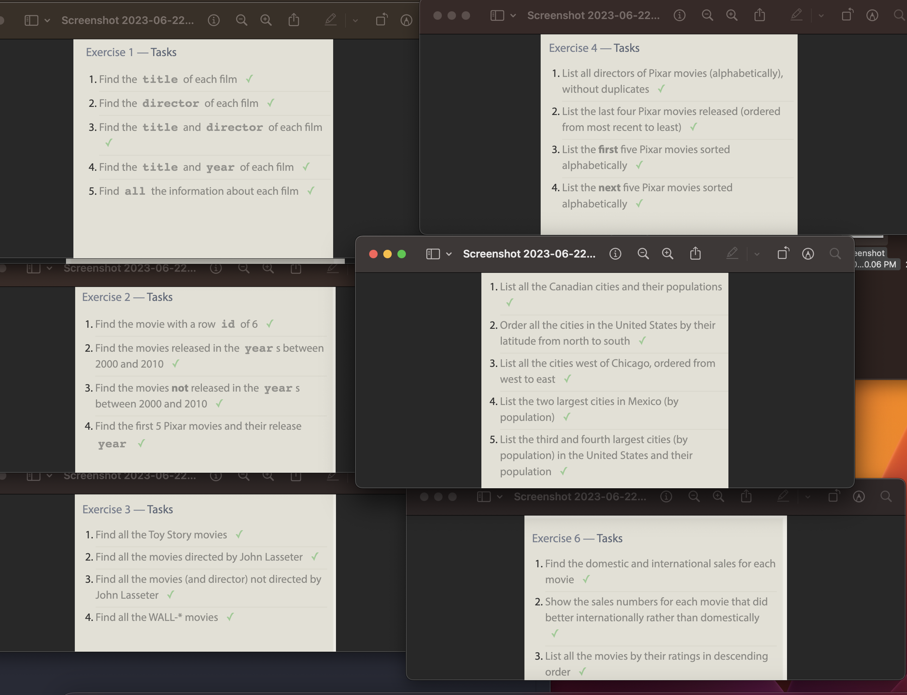
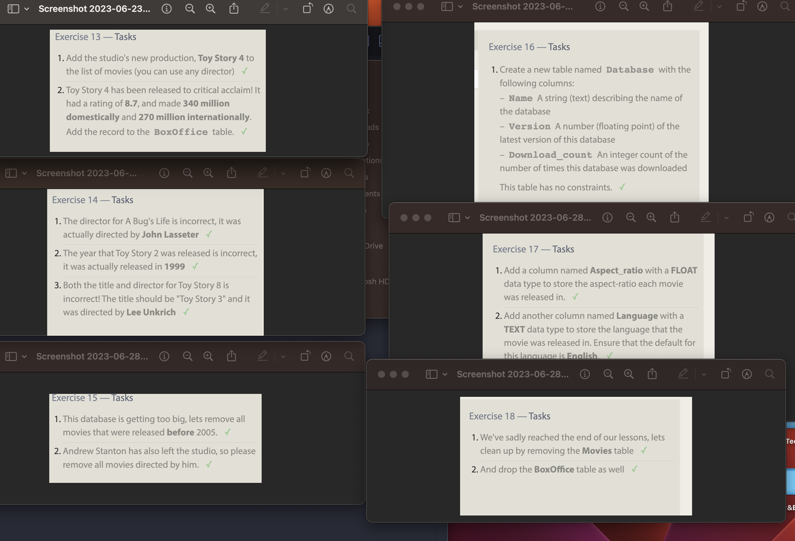

# Day 1 notes

## SQL 

Relational databases are like organized collections of data stored in tables, where each table represents a specific type of information, and the tables are related to each other based on common attributes. SQL (Structured Query Language) is a language used to interact with these databases. It allows you to perform operations like adding, retrieving, updating, and deleting data from the tables. SQL uses simple commands like SELECT, INSERT, UPDATE, and DELETE to manipulate the data. It provides a standardized way to work with relational databases, making it easier to store, manage, and retrieve data efficiently.

Below are the images for the SQL exercises.

## Terminal

The Command Line:

The command line is a text-based interface where you can interact with your computer by typing commands.
The command line works by executing commands that you enter as text. To access it, you can open a terminal or command prompt on your computer.

The Linux directory system is a hierarchical structure that organizes files and directories on a Linux-based operating system. To navigate through the Linux directory system, you can use commands like "cd" to change directories, "ls" to list the contents of a directory, and "pwd" to display the current directory.

In Linux, files and directories have permissions that control who can access, modify, or execute them. They also have ownership assigned to users and groups. You can use commands like "ls -l" to display detailed information about files and directories, including permissions, ownership, size, and timestamps.

Linux provides manual pages (man pages) that contain detailed documentation for commands. You can access them by typing "man" followed by the command name to learn more about its usage and options. Linux manual pages provide information about the purpose, syntax, options, and examples of using commands. They are a valuable resource to understand and master different Linux commands.
File Manipulation:

You can create files and directories using the "touch" and "mkdir" commands, remove them using "rm" and "rmdir," rename using "mv," and copy or move them with "cp" and "mv" commands, respectively. The basic commands for file manipulation in Linux include "touch" to create files, "rm" to remove files, "mv" to rename or move files, "cp" to copy files, and "mkdir" to create directories.